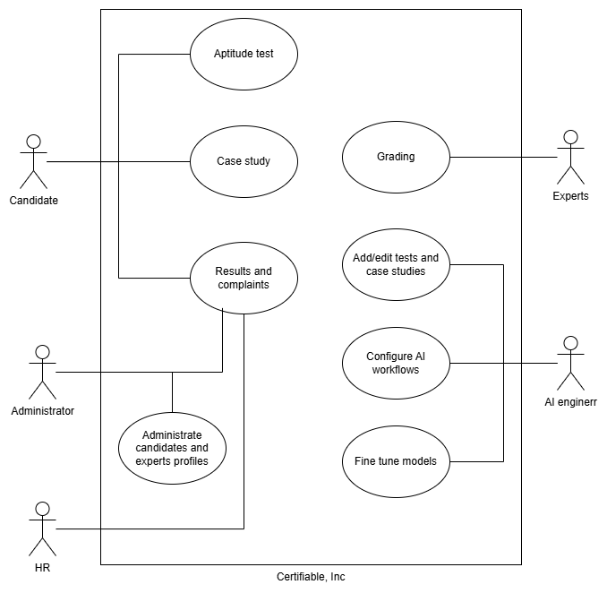

# Use Case Documentation

## Diagram

## Overview

This document outlines the use cases for the certifiable system as described in the architecture solution.

## Use Cases

### Use Case 1: User Authentication

**Description:**  
Users must be able to securely log in to the system using their credentials.

**Actors:**  
- User
- Authentication Service

**Preconditions:**  
- User has a valid account.

**Postconditions:**  
- User is authenticated and granted access to the system.

**Main Success Scenario:**
1. User navigates to the login page.
2. User enters their credentials.
3. System validates the credentials.
4. User is granted access to the system.

### Use Case 2: Data Entry

**Description:**  
Users can enter data into the system for processing.

**Actors:**  
- User
- Data Entry Service

**Preconditions:**  
- User is authenticated.

**Postconditions:**  
- Data is successfully entered and stored in the system.

**Main Success Scenario:**
1. User navigates to the data entry page.
2. User enters the required data.
3. System validates the data.
4. Data is stored in the system.

## References

For more detailed information, refer to the [Certifiable System Use Case](../adr/06_certifiable_system_usecase.md) document.