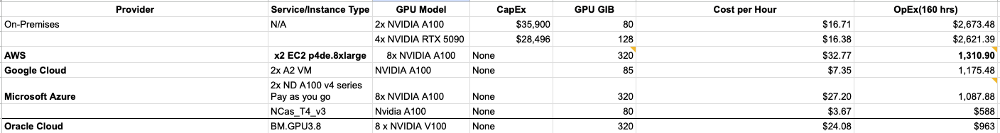
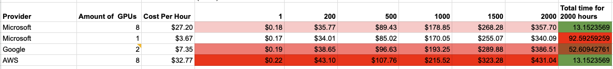

## On-Prem: High Risk, Low Flexibility

An On-Premises solution seemed cost-effective at first glance. However, detailed calculations exposed substantial financial and operational burdens, including:
- **High CapEx and OpEx**: Infrastructure investments are substantial, with ongoing maintenance costs.
- **Maintenance Risks**: Hardware failures, such as a GPU malfunction, require immediate, costly replacements or system migrations.
- **Resource Constraints**: Requires in-house expertise and resources for maintenance and scaling.

### Cost Breakdown:
- **2x A100 80** GPUs → $16.71 per hour
- **4x 5090 128** GPUs → $16.38 per hour

**Additional Risks:**
- No built-in geo-redundancy or disaster recovery, unlike cloud solutions.
- Increased dependency on internal teams for support and upgrades.

### Conclusion:
On-Prem is unsuitable due to high upfront costs, maintenance risks, and scalability challenges. It may only be viable if reusable infrastructure and in-house expertise are readily available.

---

## SaaS: Convenience with Limitations

SaaS solutions, such as GPT-4, provide ease of use and rapid deployment but introduce significant cost and privacy concerns.

### Cost Analysis:
For processing **20,000 tokens** per submission:
- **Input**: 1000 tokens × $0.03 × 20,000 = $480 per submission
- **Output**: 1000 tokens × 4 × $0.06 = $240 per submission
- **Total for 2 submissions**: $480 + $240 = $720

### Key Drawbacks:
- **Data Privacy Risks**: Potential exposure to logging and retention policies by the SaaS provider.
- **Limited Customization**: Restricted fine-tuning capabilities compared to self-hosted solutions.
- **Vendor Lock-In**: Migration to another provider may require significant code changes.

### Conclusion:
SaaS is not suitable for our needs due to high operational costs, data privacy concerns, and limited customization.

---

## IaaS: The Optimal Hybrid Solution (Our Choice)

**IaaS** emerged as the most flexible and cost-effective option, balancing scalability, control, and risk management. It allows us to fine-tune our LLM solution while leveraging cloud infrastructure's redundancy and scalability.

### Cost Comparison:
1. [AWS](https://calculator.aws/#/estimate?id=67ddc5a282d4d84c832c1ddb77cff988fbb5e7e3)
2. [Google Cloud](https://cloud.google.com/products/calculator?dl=CjhDaVE0TVRVNE16RmhOQzAwWlRZM0xUUTJaV010T1dNMFppMHlPV00wTmpVNVpqWmxZemNRQVE9PRAQGiQ1QkZFRTg3Ni0xNTg1LTQzNEUtQTQ4RS0xN0I1RjU0NTFFMzY)
3. [Microsoft Azure 8x NVIDIA A100](https://azure.com/e/a31f037aebdb4c55877a5c7813f4cf70)
4. [Microsoft Azure 1x NVIDIA A100](https://azure.com/e/6d46ec252b5747809f8d0776ad8daf1b)

### Advantages:
- **Scalability**: Easily adjust resources based on workload demands.
- **Cost Efficiency**: Pay-as-you-go model reduces upfront costs.
- **Customizability**: Full control over infrastructure configuration and model tuning.

### Tradeoff Analysis:

Based on the above comparison, we face a tradeoff between using **Microsoft's cheaper A100 HMs** versus **8x A100** for processing **2000 candidates load**:
- **A100 HMs**: Requires **92 hours** at a cost of **$340**
- **8x A100**: Completes in **13 hours** at a cost of **$358**

Although the A100 HMs are slightly cheaper, the significant difference in processing time makes the **8x A100** a more logical choice. It offers a better balance of cost and time efficiency, ensuring faster delivery without a substantial cost increase.

### Conclusion:
IaaS offers the right balance of flexibility, scalability, and cost-efficiency. It minimizes operational risks compared to On-Prem solutions while avoiding the high costs and vendor lock-in issues associated with SaaS.

---

###

Based on what you can see on screenshot we have tradeoff to use microsoft cheaper A100 HMs but process 92 hours on 2000 candidates load for 340 \$ vs 13 hours for 8x A100 for 358 \$. It seems logical to keep top tier HM based on difference in time and cost profit.

## Final Recommendation:
Based on our detailed analysis, **IaaS** is the optimal choice for our LLM solution. It provides:
- **Scalable infrastructure** to handle variable workloads
- **Operational flexibility** without significant upfront investments
- **Reduced risk** through cloud-based redundancy and disaster recovery options

This strategic choice aligns with our cost optimization goals while ensuring scalability and maintainability for our solution.

